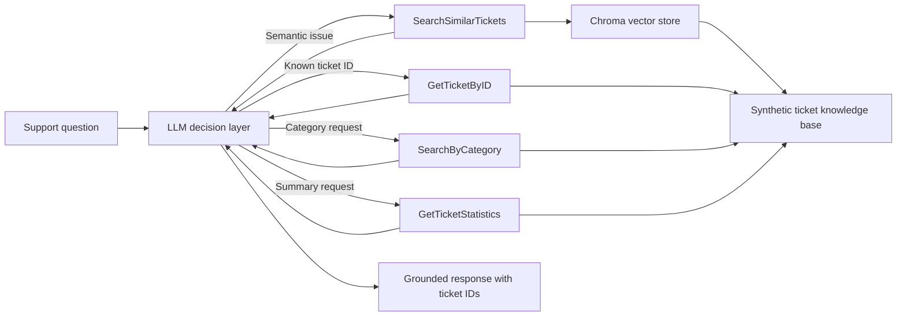

# 🧠 Agentic RAG Knowledge Assistant for IT Support Teams

An end-to-end, grounded support assistant that searches historical tickets, selects the right retrieval tool, and turns prior resolutions into concise, traceable troubleshooting guidance.

> **Goal:** Make support knowledge reusable without sacrificing source traceability. The assistant grounds recommendations in historical tickets and cites ticket IDs instead of answering from model memory alone.

---

## 1️⃣ Project Title & Value Proposition

**Agentic RAG Knowledge Assistant for IT support teams, accelerating incident investigation with grounded resolutions from historical tickets.**

The project combines semantic retrieval, deterministic lookup tools, and an LLM-driven ReAct loop. Instead of forcing an analyst to search ticket history manually, the assistant decides how to retrieve the relevant evidence and synthesizes an answer from it.

---

## 2️⃣ Background & Problem Context

IT support teams repeatedly diagnose issues that resemble incidents already resolved elsewhere in the organization. The useful knowledge exists, but it is buried in ticket descriptions, resolutions, categories, priorities, and IDs.

At small scale, an analyst can search this history manually. At larger scale, keyword mismatch, inconsistent issue descriptions, and multi-part questions make that process slow and unreliable. A simple chatbot can produce a fluent response, but it may invent a resolution. A fixed workflow can retrieve records, but it cannot dynamically choose between semantic search, exact ticket lookup, category filtering, and aggregate analysis.

This project addresses that gap with an assistant that retrieves before it recommends and exposes its tool decisions during execution.

---

## 3️⃣ Target User & Job To Be Done (JTBD)

**Primary user:** IT support engineer or service-desk analyst investigating a technical issue.

**Secondary users:** Support operations managers reviewing ticket patterns and engineering teams looking for recurring incident causes.

**JTBD:** Find relevant historical incidents and apply their verified resolutions quickly, while retaining enough source context to validate the recommendation.

---

## 4️⃣ Why an Agentic Approach

The correct retrieval strategy depends on the request:

- “How do I fix authentication problems?” requires semantic similarity search.
- “Show me TICK-005” requires exact lookup.
- “What payment issues have we seen?” requires category filtering.
- “Give me an overview of the database” requires aggregation.
- “Find critical database issues and explain how they were resolved” may require multiple tool calls and synthesis.

A static script would need rigid intent rules for every variation. A basic chatbot would lack grounded access to ticket history. Here, the LLM reasons over tool descriptions, chooses one or more tools, inspects their results, and repeats until it can answer or reaches the iteration limit.

---

## 5️⃣ Agent Role, Scope & Autonomy Level

The agent owns the retrieval-and-response loop end to end:

- Interpret the user’s support question.
- Select the appropriate ticket tool.
- Execute one or more retrieval steps.
- Synthesize a concise answer grounded in tool output.
- Reference ticket IDs when recommending a resolution.
- Maintain context across a multi-turn conversation.

Its autonomy is intentionally bounded. It can read and summarize the local synthetic ticket dataset, but it cannot modify tickets, execute remediation, contact users, or change production systems. A support engineer remains responsible for validating and applying any proposed fix.

---

## 6️⃣ Agent Architecture & Components



### Planner / decision layer

`ChatOpenAI` is bound to four function-style tools. On each iteration, the model either returns a final answer or emits tool calls. The loop supports dynamic planning rather than a predefined routing tree.

### Executors / tools

| Tool | Responsibility |
|---|---|
| `SearchSimilarTickets` | Semantic top-3 retrieval for troubleshooting and “how to fix” questions |
| `GetTicketByID` | Deterministic lookup for a specific ticket |
| `SearchByCategory` | Case-insensitive filtering by issue category |
| `GetTicketStatistics` | Total, category, and priority distributions |

### Memory

- **Short-term:** LangChain message history preserves user, assistant, and tool messages during a conversation.
- **Long-term:** Chroma persists OpenAI embeddings of ticket descriptions and resolutions on local disk.

### Orchestration

The ReAct-style loop is capped at five iterations. Unknown tools return an explicit error, and the agent stops when the model produces no further tool calls. Before each tool call, the prompt asks the model to emit a short `Decision:` rationale for observability.

---

## 7️⃣ End-to-End Agent Workflow

1. A user submits a troubleshooting, lookup, category, or reporting question.
2. The system prompt instructs the model to ground troubleshooting answers in historical tickets.
3. The model evaluates the available tools and emits a decision rationale.
4. The selected tool retrieves evidence from JSON records or the Chroma vector store.
5. The tool result is appended to the conversation as a `ToolMessage`.
6. The model either calls another tool or synthesizes a final answer.
7. The response cites relevant ticket IDs when evidence is available.
8. If the loop exceeds five iterations, the run terminates with an explicit fallback message.

---

## 8️⃣ Tools, Models & Stack

| Component | Technology | Why it is used |
|---|---|---|
| Reasoning and generation | OpenAI chat model via `ChatOpenAI` | Tool selection, multi-step synthesis, and grounded response generation |
| Default chat model | `gpt-4o-mini` | Cost-efficient tool calling; configurable with `OPENAI_CHAT_MODEL` |
| Embeddings | `text-embedding-3-small` | Converts ticket content into vectors for semantic similarity search; configurable with `OPENAI_EMBEDDING_MODEL` |
| Agent framework | LangChain | Standard message types, tool abstractions, model binding, and execution loop |
| Vector database | Chroma | Lightweight local persistence and top-k similarity retrieval |
| Knowledge source | JSON | Transparent, version-controlled ticket records for a reproducible prototype |
| Configuration | `python-dotenv` | Loads local API and model settings from environment variables |

---


## 9️⃣ Evaluation Strategy & Metrics

The evaluation suite uses `evaluation_queries.json`, which contains 15 questions with reference answers and labeled relevant ticket IDs. Run it with:

```bash
python Agent/Agentic-RAG.py \
  --evaluate /path/to/evaluation_queries.json \
  --output evaluation_results.json \
  --k 3
```

| Metric | Method |
|---|---|
| **Groundedness** | LLM-as-a-judge scores the proportion of substantive answer claims supported by the agent’s retrieved evidence, from 0 to 1. |
| **Retrieval quality** | Mean Reciprocal Rank (MRR) and Hit Rate@k compare ranked semantic-search results with labeled `relevant_ticket_ids`. |
| **Completeness** | LLM-as-a-judge scores how fully the generated answer covers the material points in `reference_answer`, from 0 to 1. |
| **Precision@k** | Relevant retrieved tickets divided by all retrieved tickets. |
| **Recall@k** | Relevant retrieved tickets divided by all labeled relevant tickets. |
| **F1@k** | Harmonic mean of Precision@k and Recall@k. |
| **Task success rate** | Percentage of judge-evaluated answers marked successful based on relevance, correctness, completeness, and groundedness. |
| **Latency** | End-to-end agent execution time per query measured with a monotonic clock; the report includes mean latency. |
| **Cost per run** | Calculated from recorded input/output tokens only when explicit per-million-token rates are provided. Agent and judge usage are included. |

Cost configuration:

```env
OPENAI_JUDGE_MODEL=your_judge_model
OPENAI_INPUT_COST_PER_1M_TOKENS=your_current_input_rate
OPENAI_OUTPUT_COST_PER_1M_TOKENS=your_current_output_rate
```

The evaluator does not hard-code or guess model prices. If either rate is missing, cost is reported as unavailable. If the judge returns invalid JSON or invalid scores, groundedness, completeness, and task success are reported as unavailable for that query and counted under `judge_failures`; no score is fabricated.

No metric values are claimed here because the evaluation has not been executed with valid API credentials and explicitly configured pricing. The generated JSON report contains aggregate metrics, per-query results, retrieved ticket IDs, answers, judge explanations, token usage, latency, cost when configured, and judge failures.


## 9️⃣ Evaluation Strategy & Metrics

The repository includes three lightweight behavioral checks covering semantic troubleshooting, exact ticket retrieval, and aggregate statistics.

| Metric | How to measure | Current status |
|---|---|---|
| Tool-selection accuracy | Expected tool vs. tool actually invoked | Test cases defined; automated assertion/reporting is not yet implemented |
| Groundedness | Percentage of factual claims supported by retrieved ticket fields | Not yet measured |
| Ticket citation rate | Percentage of troubleshooting answers containing a valid `TICK-*` ID | Partially checked with expected substrings |
| Retrieval quality | Recall@3 / MRR against labeled relevant tickets | Not yet measured |
| Task success rate | Human-rated correct and actionable responses | Not yet measured |
| Latency | End-to-end and per-tool duration | Not yet instrumented |
| Cost per run | Chat and embedding token cost | Not yet instrumented |
| Human intervention rate | Percentage of questions requiring analyst escalation | Not yet measured |

The current dataset contains **20 synthetic resolved tickets** spanning **14 categories**. Authentication is the largest category with four tickets; priorities comprise nine High, five Critical, and six Medium tickets. These counts describe the demo corpus, not production performance.

---

## 🔟 Guardrails, Trust & Safety

- The assistant is read-only and cannot perform production remediation.
- Troubleshooting prompts instruct it to search the ticket base before answering.
- Responses should name ticket IDs so an analyst can inspect the source record.
- The model must acknowledge insufficient information instead of inventing evidence.
- Tool calls and short decision rationales are printed for traceability.
- A five-iteration cap bounds runaway tool use and cost.
- Human review is required before applying any recommendation to a live environment.

For production use, add authorization, sensitive-data redaction, prompt-injection defenses, structured audit logs, retrieval confidence thresholds, and an explicit escalation path.

---

## 1️⃣1️⃣ Failure Modes & Tradeoffs

- **Small synthetic corpus:** Similarity search always returns up to three records, even when relevance is weak.
- **No confidence threshold:** The system cannot currently distinguish a marginal match from a strong one.
- **Model-dependent routing:** Tool selection may vary across model versions or prompt changes.
- **String-based category matching:** Category queries require the canonical category name.
- **In-memory conversation growth:** Long conversations are replayed without summarization or token-budget management.
- **Local vector persistence:** Suitable for a prototype, but not for multi-user scaling or centralized governance.
- **Limited evaluation:** The included test cases print responses but do not assert pass/fail outcomes.
- **Path sensitivity:** `SupportTicketTools` currently uses a relative default ticket path. After cloning, update it to point to `data/synthetic_tickets.json` for your execution directory before running the demo.

The implementation favors transparency and simplicity over production throughput. Semantic retrieval improves recall but adds embedding cost; deterministic tools are faster and more precise but cover narrower intents.

---

## 1️⃣2️⃣ Results, Learnings & Insights

- A small set of well-described tools supports several distinct support workflows without a separate intent classifier.
- Combining deterministic retrieval with semantic search gives the agent both precision and flexibility.
- Preserving tool messages in conversation lets follow-up questions such as “What was the ticket ID?” reuse earlier evidence.
- Exposing a short decision rationale makes routing behavior easier to inspect during development.
- The prototype demonstrates the agent loop successfully, but credible quality claims require assertion-based tests and a labeled evaluation set.

---

## 1️⃣3️⃣ Future Improvements & Iteration Plan

- Add relevance thresholds, reranking, and a “no supporting ticket found” route.
- Convert the demo checks into deterministic unit and integration tests.
- Add groundedness, citation-validity, latency, token, and cost telemetry.
- Move orchestration to a state graph with explicit retry and escalation nodes.
- Introduce hybrid keyword/vector retrieval and metadata filters.
- Add ingestion for new tickets, incremental indexing, and document versioning.
- Protect sensitive fields with role-based access control and PII redaction.
- Add a web or service-desk interface and collect analyst feedback.
- Replace local Chroma persistence with a production-ready shared vector store when scaling beyond a single process.

---

## 1️⃣4️⃣ Demo & Artifacts

### Repository structure

```text
.
├── Agent/
│   ├── Agentic-RAG.py       # Agent loop, examples, memory, and evaluation cases
│   └── tools.py             # Retrieval tools and Chroma indexing
├── data/
│   └── synthetic_tickets.json
└── requirements.txt
```

### Setup

```bash
git clone https://github.com/pbhat123/Agentic-RAG-End-to-End-GroundedITSupportKnowledgeAssistant.git
cd Agentic-RAG-End-to-End-GroundedITSupportKnowledgeAssistant

python -m venv .venv
source .venv/bin/activate
pip install -r requirements.txt
```

Create a `.env` file:

```env
OPENAI_API_KEY=your_api_key_here
OPENAI_CHAT_MODEL=gpt-4o-mini
OPENAI_EMBEDDING_MODEL=text-embedding-3-small
```

Before running, make sure the `tickets_path` passed to `SupportTicketTools` resolves to:

```text
data/synthetic_tickets.json
```

Then run the agent demo:

```bash
python Agent/Agentic-RAG.py
```

### Example capabilities

```text
How do I fix authentication problems after password reset?
Show me details of ticket TICK-005.
What payment-related issues have we seen?
Give me an overview of the ticket database.
Find database-related critical issues and tell me how they were resolved.
```

---

## 1️⃣5️⃣ Role-Based Signal

**For Product Managers:** Demonstrates operational problem framing, bounded autonomy, success metrics, trust requirements, and explicit cost/quality tradeoffs.

**For Engineering Managers:** Demonstrates modular agent design, tool orchestration, persistent retrieval, failure boundaries, observability, and a path from prototype to scalable service.

**For Software Engineers:** Demonstrates function calling, semantic retrieval, conversation memory, deterministic tool adapters, iteration limits, and testable separation between reasoning and execution.

---

## 📄 License

No license file is currently included. Add one before distributing or accepting external contributions.
